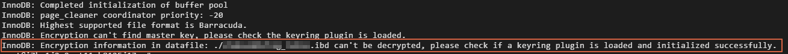
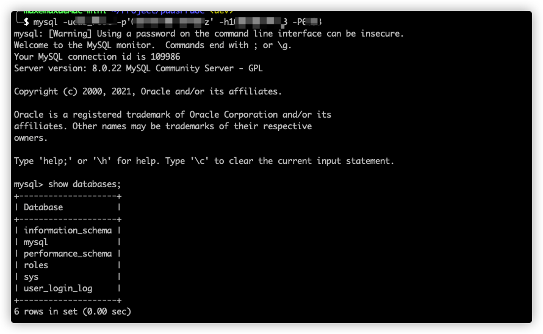

本文介绍如何从云数据库 MySQL的物理备份文件恢复到自建数据库。

>
> 注: 只支持将云数据库MySQL的备份文件恢复到安装在Linux系统中的自建MySQL数据库中

## 一、准备环境

1. 准备一台Linux 64位系统服务器。确认服务器上已安装MySQL服务，且MySQL版本与云数据库 MySQL版本相同（例如都是5.7）。

   >
   > 注: 请确保该MySQL服务上没有运行其他业务，仅用于恢复数据。

2. 在Linux服务器上，安装Percona XtraBackup。

   - 对于MySQL 5.7、5.6实例：安装[Percona XtraBackup 2.4](https://www.percona.com/doc/percona-xtrabackup/2.4/installation.html)。
   - 对于MySQL 8.0实例，安装[Percona XtraBackup 8.0](https://www.percona.com/doc/percona-xtrabackup/8.0/installation.html)。
   
2. 确保服务器已有mysql用户，如果没有创建用户

   ```bash
   useradd -g mysql mysql
   ```
   
   

## 二、下载备份

1. 访问云数据库[MySQL实例列表](https://console.capitalonline.net/dbinstances) 控制台，通过实例ID搜索目标实例，然后单击目标实例ID。

2. 进入**备份恢复**标签页面。

3. 如需查看7天前的备份，请修改时间范围。默认时间范围是近7天。

4. 在操作列，单击目标备份的**下载**按钮。

5. 在弹出数据备份下载对话框中，复制内网下载地址和本地下载。

   > 提示:
   > 
   > 如果是相同虚拟数据中心内的虚拟机，可以使用内网地址，速度更快更稳定。

6. 在Linux服务器上，执行如下命令下载物理备份。

   ```bash
   wget -c http://{地址} -O backup.tar.gz
   ```

   

## 三、解压和恢复备份

1. 在Linux服务器上，创建一个目录（例如/home/mysql/data）用于存放解压后的文件。

   ```bash
mkdir -p /home/mysql/data
   ```

2. 解压压缩包。根据压缩包的后缀选择解压命令。

   ```bash
   tar -zxvf backup.tar.gz -C /home/mysql/data
   ```
   > 提示： 您可以把*backup*和*/home/mysql/data*替换为实际的文件名和路径。
   
2. 设置目录权限

   ```bash
   chown -R mysql:mysql /home/mysql/data
   ```
   
2. 执行如下命令，查询解压后生成的文件。

   ```bash
   ls -l /home/mysql/data
   ```
   
5. 执行如下命令，恢复解压好的备份文件。

   ```bash
   ## MySQL 5.6/5.7
   innobackupex --defaults-file=/home/mysql/data/backup-my.cnf --apply-log /home/mysql/data
   
   ## MySQL 8.0
   xtrabackup --prepare --target-dir=/home/mysql/data
   xtrabackup --datadir=/var/lib/mysql --copy-back --target-dir=/home/mysql/data
   ```

   - 恢复时请耐心等待，若系统返回如下类似结果，则说明备份文件已成功恢复到自建数据库。

     ```bash
     xtrabackup: Transaction log of lsn (3037472) to (3037472) was copied.
     170824 22:57:58 completed OK!
     ```

   - 使用xtrabackup恢复mysql数据时候报错:Original data directory is not empty! at /usr/bin/innobackupex line 568.

     ```bash
     rm -rf /home/mysql/data #命令清空文件夹内文件
     mkdir -p /home/mysql/data #重新创建目录 
     chown -R mysql:mysql /home/mysql/data  #修改权限
     ```

   - 若系统返回如下报错，请参见[准备环境一](#一、准备环境)中的第2项说明。


**说明** 请确保您的Percona XtraBackup版本正确：

- MySQL 5.7、5.6以及之前的版本需要安装 Percona XtraBackup 2.4，安装指导请参见官方文档[Percona XtraBackup 2.4](https://www.percona.com/doc/percona-xtrabackup/2.4/installation.html)。
- MySQL 8.0版本需要安装 Percona XtraBackup 8.0，安装指导请参见官方文档[Percona XtraBackup 8.0](https://www.percona.com/doc/percona-xtrabackup/8.0/installation.html)。

## 四、启动MySQL

1. 为避免版本问题，需修改backup-my.cnf文件，具体操作步骤如下。

   1. 执行如下命令，以文本方式编辑backup-my.cnf文件。

      ```bash
      vi /home/mysql/data/backup-my.cnf
      ```

   2. 添加如下参数：

      ```undefined
      lower_case_table_names=1
      ```

   3. 注释掉如下自建数据库不支持的参数：

      ```bash
      #innodb_log_checksum_algorithm
      #innodb_fast_checksum
      #innodb_log_block_size
      #innodb_doublewrite_file
      #innodb_encrypt_algorithm
      #master_key_id
      #server_uuid
      ```

      按**Esc**键，然后输入`:wq`并回车进行保存。

2. 执行如下命令，修改文件属主，并确定文件所属为MySQL用户。

   ```bash
   chown -R mysql:mysql /home/mysql/data
   ```

3. 执行如下命令，启动MySQL进程。

   ```bash
   mysqld --defaults-file=/home/mysql/data/backup-my.cnf --user=mysql --datadir=/home/mysql/data &
   ```

   **说明** root密码问题：

   - 如果您的实例版本为MySQL 5.7或8.0，则root密码即自建库的root密码。
   
   常见错误
   
   如果Ubuntu操作系统报如下错误，是Ubuntu自带安全程序AppArmor导致的，请使用`apt install -y apparmor-utils`和`aa-complain /usr/sbin/mysqld`命令修改AppArmor设置。
   
   
   
4. 执行如下命令，登录MySQL数据库以验证进程启动成功。

   ```undefined
   mysql -u<源云数据库MySQL实例账号> -p<对应密码>
   ```

   您可以使用`show databases;`查看数据库，确认是否恢复成功。
   

## 常见问题

- 为什么下载数据备份文件会报错？

  使用`wget -c '<数据备份文件外网下载地址>' -O <自定义文件名>.tar.gz`命令下载时用2个英文单引号（'）将下载地址包含起来，便于程序识别具体的地址，防止出错。

- 下载的备份文件解压缩报错怎么办？

  1. 确认您下载的文件是否为物理备份文件。
  2. 压缩文件保存的名称后缀是否正确（使用URL中包含的文件名后缀 .tar.gz ）。

- 下载的物理备份能恢复到另一个云数据库 MySQL实例上吗？

  不支持此操作。