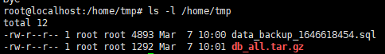
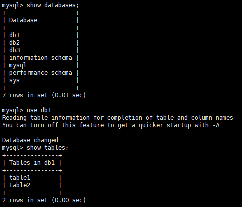

## 操作场景

MySQL 自带的 mysqldump 可以通过逻辑备份文件恢复数据库，本文将介绍详细的操作步骤。

## 注意事项

- 本文使用 Linux 7 的操作系统为例进行演示。
- 本地 MySQL 数据库安装在 64 位的 Linux 系统中，且与云数据库 MySQL 版的版本相同。

## 操作步骤

1. 下载逻辑备份。

   ```
   wget -c '<备份文件下载地址>' -O <自定义文件名>.tar.gz
   ```

2. 执行如下命令，解压已下载的数据备份文件。

   > **说明**：本文以自定义路径 `/home/tmp` 为例，您可以根据实际情况将其替换成实际路径。

   目前逻辑备份文件格式为 tar 压缩包 （.tar.gz 后缀），使用以下命令解压：

   ```
   tar -xvf <逻辑备份文件名>.tar.gz -C /home/tmp
   ```

   > **说明**：
   >
   > **-C**：指定文件要解压到的目录。可选参数，若不指定就解压到当前目录。

3. 执行如下命令，查询解压后生成的文件。

   ```
   ls -l /home/tmp
   ```

   命令执行成功后，系统会返回如下结果，其中蓝色字体为生成备份文件时云数据库 MySQL 实例所包含的数据库。

   

4. 解压需要恢复的备份压缩文件，命令如下：

   ```
   gzip -d /home/tmp/目标数据库压缩文件名称
   ```

5. 使用以下命令将 `.sql` 文件导入对应数据库。

   ```
   mysql -u root -p <指定空数据库名> < /home/tmp/解压缩的数据库文件
   ```

   > **说明**：
   >
   > 如不指定数据库名称，则导入该解压缩的数据库文件中全部库表进行恢复。

6. 登录 MySQL 数据库验证逻辑备份恢复是否成功。

   
