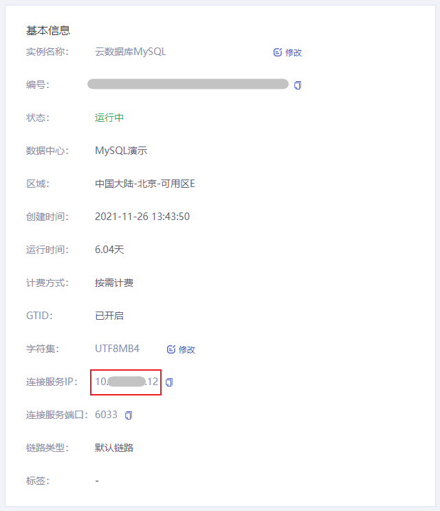
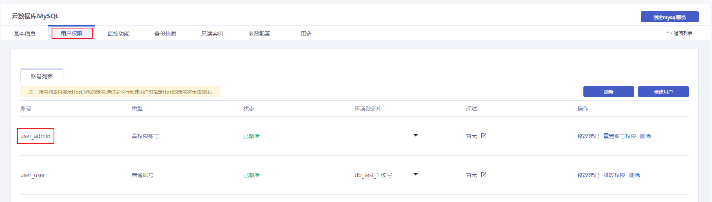

## 连接MySQL实例出现 Access denied for user 'xxx'@'xxx' 报错

### 常见原因

1. 用户名错误
2. 账号密码错误
3. 连接 IP 地址错误

### 解决方案

1. 进入 [云数据库 MySQL 控制台](https://console.capitalonline.net/dbinstances)，在实例列表中选择需要调整资源的实例，点击实例名称进入实例管理页面。

2. 在基本信息中找到 **基本信息** 模块，检查连接服务 IP 是否无误。

   

3. 点击 **用户权限**，在用户权限页面检查用户名是否正确。

   

4. 确认连接服务 IP 与账号均无错误，重试密码，若以忘记密码，可点击 **修改密码** 重置账号密码。

   
