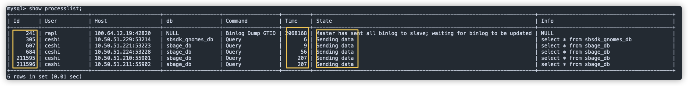
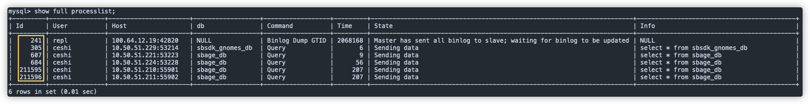

MySQL实例在日常使用中会出现实例 IOPS 使用率高的情况，本文将介绍造成该状况的主要原因和解决方法。

## 常见原因

- 实例内存满足不了缓存数据或排序等需要，导致产生大量的物理 IO。
- 查询执行效率低，扫描过多数据行。

## 解决方法

> **注意**：
>
> - RDS MySQL 实例在连接数打满的情况下，无法通过 PHPMyAdmin 或者 MySQL 命令行等工具连接登录实例。
> - 如果无法通过 phpMydmin 或 MySQL 命令行工具连接，建议您先在 RDS 控制台的参数设置中将 wait_timeout 参数（单位秒）设置为比较小的值（比如 60），让 MySQL 实例主动关闭空闲时间超过 60 秒的连接，以便稍后可以通过 phpMyAdmin 或者 MySQL 命令行工具连接访问实例。

### 操作步骤

1. 通过 MySQL 命令行工具连接实例。

2. 通过如下方式，查看当前实例活跃会话，确认 SQL 语句中执行的时间较长且状态为 “sending data”。

   通过执行 `show processlist;` 命令查询，结果如下图所示。

   

   若当前执行会话比较多，通过执行 `show full processlist;` 命令来查询，结果如下图所示。

   

3. 执行 `kill <Id>` 命令，终止相关会话。其中：Id 是上述步骤查询结果中的 Id 列值。
