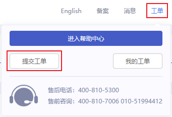
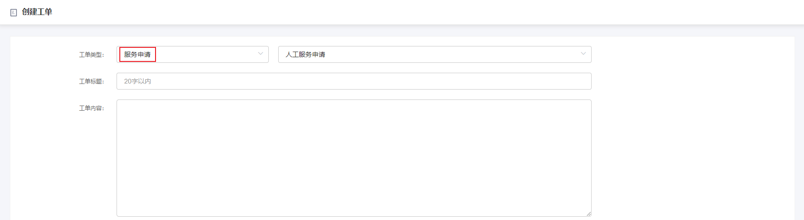

## MySQL修改密码策略

### 现象描述

目前 MySQL 8.0 暂不支持修改密码策略，当创建的实例版本选择为 MySQL 8.0 时，通过控制台创建出的用户无法修改 caching_sha2_password 为 mysql_native_password。

### 处理步骤

1.进入控制台，展开上方导航栏中的 **工单**，点击 **提交工单**。

2.进入到创建工单页，工单类型选择 **服务申请**，填写工单信息描述您的问题。

3.点击 **创建工单** 后，请耐心等待，经评估后将人工为您修改密码策略。
