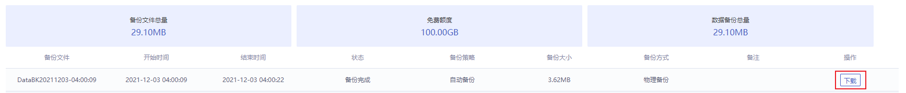

## 数据库备份相关

### 数据库备份相关问题

#### 超出备份保留时间的备份还能保留及使用吗？

超出保留时间的备份会被删除，无法继续使用，建议您设置合理备份策略，或使用手动备份，手动备份会一直保存。

#### 我可以删除备份吗？

- 自动备份不可手动删除，超出设置的数据保留时长时会自动删除。
- 手动备份可以在备份列表中点击 **删除** 进行删除，如不删除则会一直保留，详情参见 [删除备份](./../04.操作指南/07.备份恢复/02.删除备份.md)。

#### 我可以关闭自动备份吗？

您可以通过编辑备份策略，点击 **开启自动备份** 开关进行关闭自动备份操作。

#### 如何取消备份？

备份任务不可以取消。如果是手动备份，您可以在备份结束后删除备份文件。

#### 如何设置自动备份？

目前自动备份会在您创建好实例后自动进行，备份配置详情参见 [自动备份](./../04.操作指南/07.备份恢复/00.备份数据库.md#自动备份)。

#### 我该怎样下载备份？

您可以登录控制台，进入到 **备份恢复** 页面，选择列表中要下载的备份，点击操作项中的 **下载** 即可将备份下载到本地。

