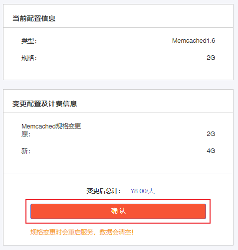

## 操作场景

您可以根据实际业务情况，在[控制台](https://console.capitalonline.net/dbmemcached)灵活变更Memcached实例的规格，从而使云数据库资源得到充分利用，控制成本。

> 注意：
>
> - 单机版Mecached在变更配置时需重启服务，重启后数据会被清空，请谨慎操作。
> - 变更配置期间会造成连接中断，从业务角度建议在低峰期执行该操作并确保应用程序具备重连机制。

## 操作步骤

1. 登录[云数据库Memcached控制台](https://console.capitalonline.net/dbmemcached)，在实例列表中选择需要变更配置的Memcached实例，点击**实例名称**进入实例管理页面。
2. 在【基本信息】页面找到**配置信息**栏，点击**修改**。

3. 选择目标规格。

4. 在【变更配置及计费信息】栏，点击**确认**。

## 费用说明

详情参见[调整实例规格费用说明](./../../03.购买指南/02.调整实例规格费用说明.md)。