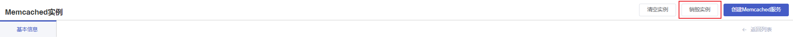
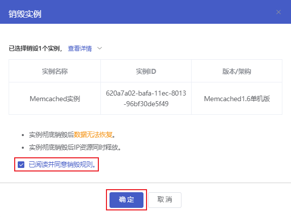

## 操作场景

根据实际业务需要，您可以在[控制台]()销毁Memcached实例。

> 注意：
>
> - 实例销毁后数据将无法恢复，请在销毁前确认实例不再使用。
> - 实例销毁后IP资源同时释放。

## 操作步骤

1. 登录[云数据库Memcached控制台]()，在实例列表中选择需要销毁的Memcached实例，点击**实例名称**进入实例管理页面。
2. 点击**销毁实例**。

3. 在弹框中，阅读销毁规则并勾选**已阅读并同意销毁规则**后，点击**确定**，即可销毁当前的Memcached实例。

