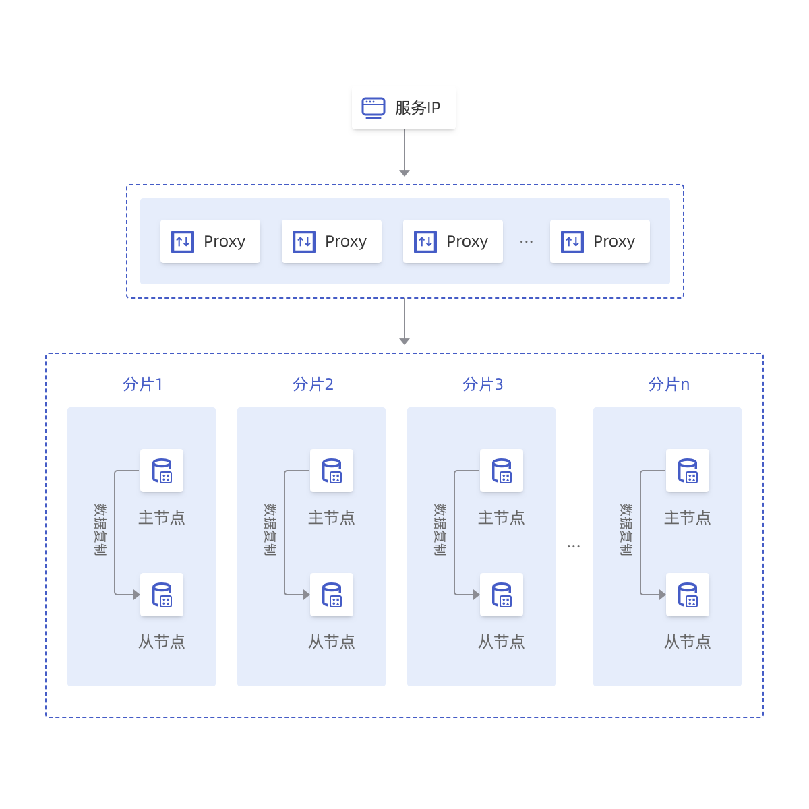

#### 社区主从版

云数据库Redis社区主从版支持1主1副本双节点，兼容Redis2.8、Redis4.0、Redis5.0协议，既能提供高性能的缓存服务，又能保证数据高可靠。主节点提供日常服务访问，从节点提供高可用，当主节点发生故障，系统会自动切换至从节点，保障业务正常运行。

- 采用双机主从架构，主从节点位于不同云主机。主节点对外提供访问，用户可通过 Redis 命令行和通用客户端进行数据的增、删、改、查操作。当主节点出现故障，系统会自动进行主从切换，保证业务平稳运行。
- 支持开启数据持久化功能，数据全部落盘。支持数据备份功能，用户可以基于备份文件恢复实例，有效地解决数据误操作等问题。

架构如下：

#### 社区集群版

云数据库Redis社区集群版是首云基于社区版 Redis cluster 打造的全新版本，兼容Redis 4.0、Redis5.0 版本命令，采用分布式架构，拥有高度的灵活性、可用性和超高 QPS性能。Redis 集群版支持多种分片选择，每分片采用一主一备架构，满足大容量、高性能的业务需求。

- Redis 集群模式数据将会自动分片，系统将提供数据均衡，数据迁移功能。
- Redis集群版可以有效地扩展数据容量，满足业务扩展的需求。
- 集群架构采用多分片的部署方式能够突破Redis单线程的性能瓶颈，QPS达到百万级。

架构如下：

