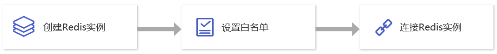

如果您是初次使用云数据库Redis，请根据新手引导学习，帮助您快速上手云数据库Redis。

## 1.云数据库Redis的基础知识

- [云数据库Redis是如何运作的？](./02.产品简介/00.产品概述.md)

- [为什么选择云数据库Redis？](./02.产品简介/01.产品优势)
- [云数据库Redis的典型应用场景有哪些？](./02.产品简介/02.应用场景)
- [使用云数据库Redis时有哪些限制？](./05.操作指南/00.使用限制)

## 2.云数据库Redis的计费方式

云数据库Redis的计费方式分为包年包月和按需计费。如果您想了解详细计费规格，请参见[计费概述](./03.购买指南/00.计费概述.md)。

## 3.云数据库Redis入门操作

### 3.1 创建云数据Redis实例

如需创建云数据库Redis实例，您需要先注册首云账号并购买云数据库Redis服务。详情参见[创建Redis实例](./04.快速入门/00.创建Redis实例.md)。

### 3.2 设置白名单

在您成功创建云数据库Redis实例后，系统默认允许同一私网网段的所有IP访问Redis实例。您可以通过设置白名单允许指定IP或IP段访问，让Redis实例得到更好的访问安全保护，具体操作详情参见[设置白名单](./04.快速入门/01.设置白名单.md)。

### 3.3 连接Redis实例

您可以通过内网方式访问已创建好的Redis实例。详情参见[连接Redis实例](./04.快速入门/02.连接Redis实例.md)。

## 4.控制台功能概述

- [变更实例规格配置](./05.操作指南/02.管理实例/00.变更配置.md)
- [Redis集群设置直连访问](./05.操作指南/02.管理实例/01.设置直连访问.md)

- [清空实例](./05.操作指南/02.管理实例/02.清空实例.md)
- [终止实例](./05.操作指南/02.管理实例/03.终止实例.md)
- [销毁实例](./05.操作指南/02.管理实例/04.销毁实例.md)
- [设置白名单](./05.操作指南/04.网络与安全.md)
- [备份数据](./05.操作指南/05.备份与恢复/00.备份数据.md)
- [恢复数据](./05.操作指南/05.备份与恢复/01.恢复数据.md)
- [监控功能](./05.操作指南/06.监控告警/00.监控功能)
- [告警功能](./05.操作指南/06.监控告警/02.告警功能)
- [账号管理](./05.操作指南/07.账号与密码/00.创建与管理账号.md)
- [免密认证访问](./05.操作指南/07.账号与密码/01.免密认证访问.md)
- [参数配置](./05.操作指南/08.参数配置.md)
- [禁用命令](./05.操作指南/09.禁用命令.md)
- [标签管理](./05.操作指南/10.标签管理.md)

## 5.新手常见问题

- [如何连接云数据库Redis？](./04.快速入门/02.连接Redis实例.md)
- [如何查看内网地址？](./09.常见问题/01.连接登录.md#如何查看内网连接地址)
- [云数据库Redis连接失败，怎么办？](./10.故障处理/00.Redis无法连接.md)
- [忘记账号密码怎么办？](./09.常见问题/02.使用数据库.md#云数据库Redis忘记账号密码怎么办)
- [错误购买了实例，如何退款？](./09.常见问题/00.购买计费.md#购买的实例不想要了)

## 6.反馈与建议

在您使用云数据库Redis期间如果有任何问题或意见，您可以通过在线工单或拨打客服电话进行反馈，我们将在第一时间为您解决问题。

- 7x24小时服务热线：400-810-5300
- 5x8小时售前服务热线：400-810-7006
