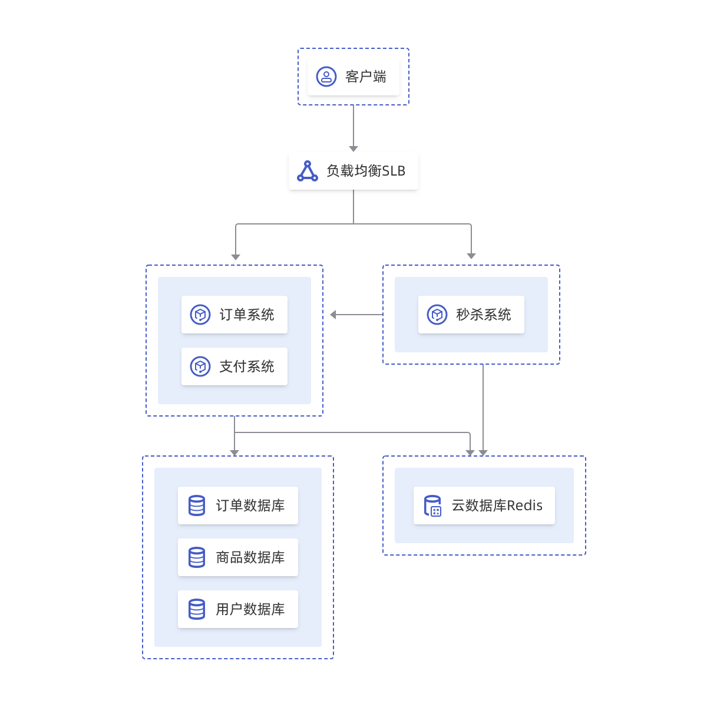

## 游戏排行场景

游戏排行场景中，可以将非角色数据，例如积分排行榜，存储在 Redis 中进行快速访问，Redis 原生自带的 SortedSet 数据类型能帮助您玩家数据排序。

## 游戏分服场景

游戏公司为了快速抢占市场，需要快速的开发出新产品吸引玩家，云数据库Redis集群版能减少系统开发复杂度，业务爆发时可轻松弹性扩容，满足高性能业务要求。

## 电商场景

电商场景中，多用于商品展示、购物推荐等模块，同时在大型促销秒杀活动时，使用Redis能轻松应对高并发访问。

## 互联网\APP场景

互联网、App 应用场景中，可以通过Redis来提高用户基础资料的读取性能，还可以将静态图片资源缓存到Redis中来提高应用加载速度。

## 视频直播场景

视频直播类节目中会大量出现流量突发场景，云数据库Redis集群版轻松突破Redis自身单线程瓶颈，QPS达到百万级，满足低时延、高并发的业务要求。

