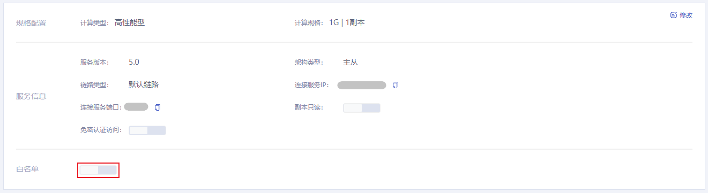
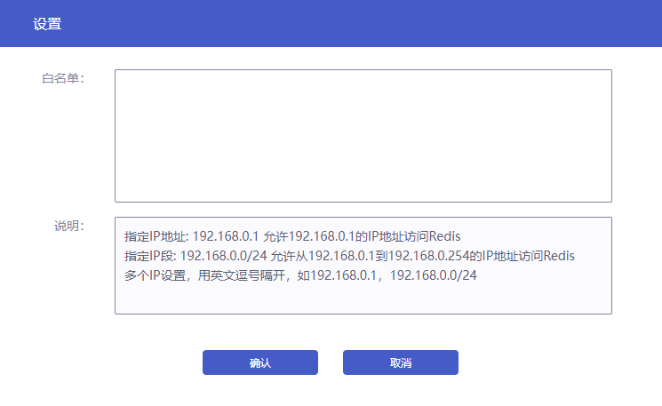

#### 操作场景

为保障云数据Redis的安全稳定，平台默认禁止所有IP访问Redis实例。在开始使用Redis实例前，您需要设置实例的白名单，以允许同一虚拟数据中心下同一私网网段的云服务器能通过内网访问Redis实例。

白名单机制可以让云数据库Redis得到高级别的访问安全保护，建议您定期维护白名单。设置白名单操作不会影响Redis实例的正常运行。

#### 操作步骤

1. 登录数据库服务页面，在实例列表中选择需要设置白名单的Redis实例，点击**实例名称**进入到实例管理页面，点击**基本信息**查看实例基本信息。
2. 点击**白名单**的开启按钮，打开白名单设置弹框。

3. 在弹框中，手动设置与云数据库Redis同一虚拟数据中心下，且在同一私网网段的云服务器 IP地址或IP段。

4. 设置完成后，点击**确认**。当实例状态恢复为运行中时，您可以在基本信息页面看到设置成功的白名单IP。

