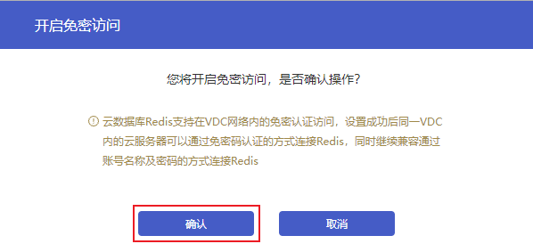
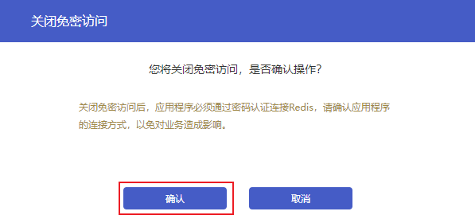

#### 操作场景

云数据库Redis支持在VDC网络内的免密认证访问，设置成功后同一VDC内的云服务器可以通过免密码认证的方式连接Redis，同时继续兼容通过账号名称及密码的方式连接Redis。在保障数据安全的前提下，使用免密认证访问可以更便捷的连接Redis实例。

#### 操作步骤

##### 开启免密认证

1. 登录数据库服务页面，点击**实例名称**进入到实例管理页面。
2. 在【基本信息】页面找到**服务信息**区域，点击**免密认证访问**开关。

3. 在开启免密访问弹框中，确认操作后，点击**确认**。

> 说明：
>
> 免密连接实例操作详情参见[连接Redis实例](./../../03.快速入门/02.连接Redis实例.md)。

##### 关闭免密认证

1. 免密认证访问为开启的状态下，点击**免密认证访问**开关。

2. 在关闭免密访问弹框中，确认操作后，点击**确认**。

> 注意：
>
> 关闭免密访问后，使用免密访问功能访问Redis的连接会断开，为避免对业务造成影响，您需要提前将应用程序的认证方式改为密码认证。