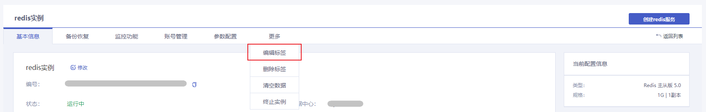
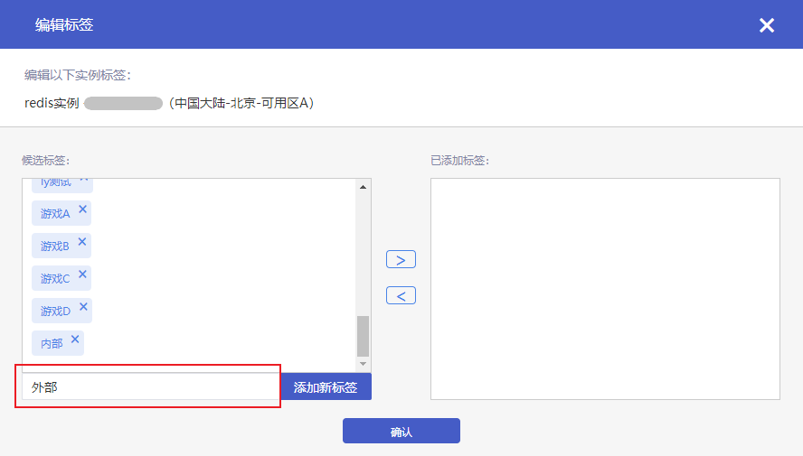
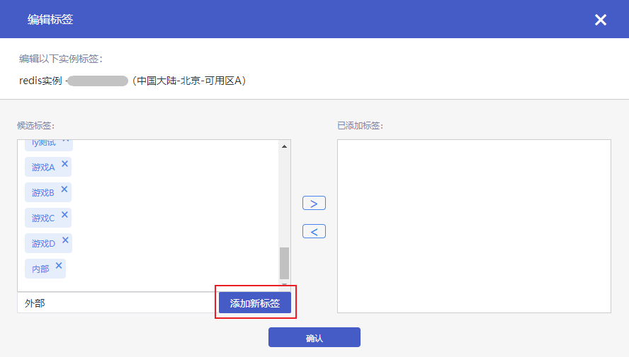
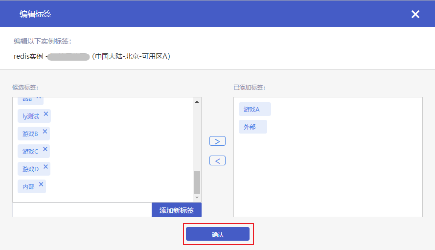
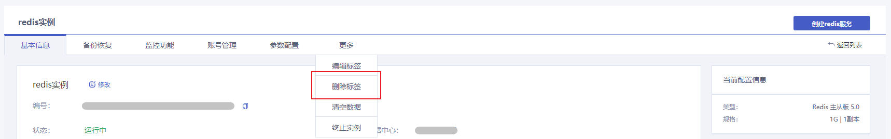
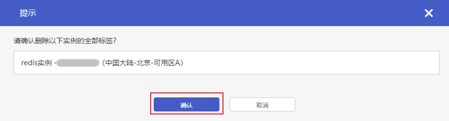

#### 操作场景

如果您有大量Redis实例，可以通过给实例绑定标签，对实例进行分类管理。

#### 操作步骤

##### 编辑标签

1. 登录数据库服务页面，点击**实例名称**进入实例管理页面。
2. 点击**更多**展开更多操作项，点击**编辑标签**。

3. 在编辑标签弹框中，如果您需要新建标签，在标签输入框中**输入新标签**。

4. 点击**添加新标签**，即可完成标签新建。

5. 点击**候选标签**列表中的标签项，将标签项移入**已添加标签**列表中，点击**确认**，即可为实例添加标签。

##### 删除标签

1. 登录数据库服务页面，点击**实例名称**进入实例管理页面。
2. 点击**更多**展开更多操作项，点击**删除标签**。

3. 在弹出的提示框中，点击**确认**。

