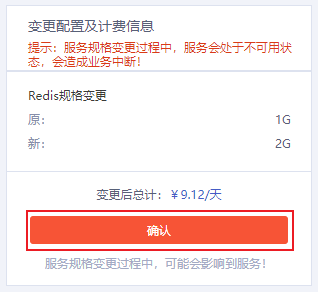

## 操作场景

根据实际业务情况，您可以在[控制台](https://console.capitalonline.net/dbinstances)灵活变更Redis实例的规格，从而使云数据库资源得到充分利用，控制成本。

> 注意：
>
> - 目前仅按需计费模式下的实例支持变更配置。
> - 因社区主从版最大容量为64GB，所以当容量达到64GB时，无法再进行扩容。
> - 为避免缩容失败，缩容后的实例规格要求大于当前实例已使用的存储空间。
> - 调整配置会触发高可用系统，主备切换需要30秒~1分钟左右执行完成，期间连接会被中断，从业务角度建议在低峰期执行该操作并确保应用程序具备重连机制。

## 操作步骤

1. 登录[云数据库Redis控制台](https://console.capitalonline.net/dbinstances)，在实例列表中选择需要变更配置的Redis实例，点击**实例名称**进入实例管理页面。
2. 在【基本信息】页面找到**规格配置**栏，点击**修改**。

3. 选择目标规格。

4. 在【变更配置及计费信息】栏，点击**确认**。

## 费用说明

详情参见[调整实例规格费用说明](./../../03.购买指南/03.调整实例规格费用说明.md)。

