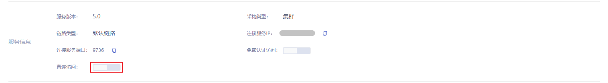
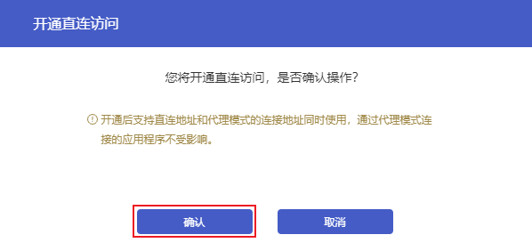
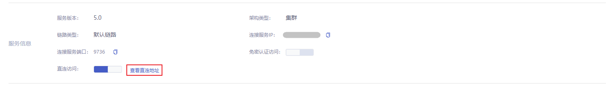
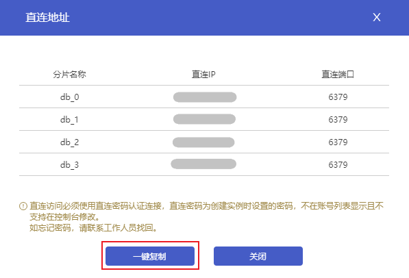
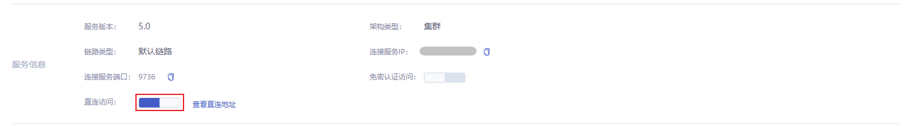
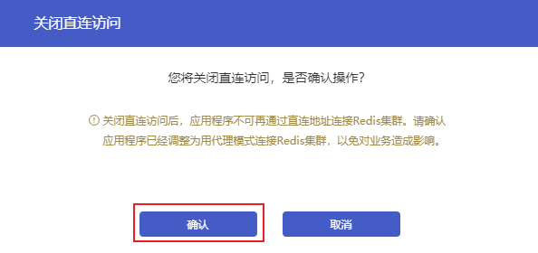

## 连接方式对比

- 代理模式：通过Redis实例提供的内网连接地址连接，客户端的请求由代理节点转发至数据节点。
- 直连模式：通过直连地址连接，客户端可以绕过代理节点，直接访问后端Redis的数据节点。

## 操作场景

云数据库Redis默认提供代理模式连接，集群版的Redis实例支持开通直连访问并提供直连地址，开通后您可以绕过代理，通过直连地址和直连密码连接Redis集群，连接方式与连接原生Redis集群无异。

> 注意：
>
> - 仅Redis社区集群版实例支持设置直连访问。
> - 支持的Redis版本为Redis4.0、Redis5.0。
> - 开通直连访问后支持直连和代理连接同时使用，通过代理连接的应用程序不受影响。

## 操作步骤

### 开通直连访问

1. 登录[云数据库Redis控制台](https://console.capitalonline.net/dbinstances)，在实例列表中选择需要开通直连访问的Redis实例，点击**实例名称**进入实例管理页面。
2. 在【基本信息】页面找到**服务信息**栏，点击**直连访问**开关。

3. 在开通直连访问弹框中，确认操作后，点击**确认**。

### 获取直连地址

1. 开通直连访问后，点击**查看直连地址**。

2. 在直连地址弹框中，查看所有分片的直连IP和端口。点击**一键复制**，将所有分片的IP和端口一键复制到剪切板。

### 关闭直连访问

1. 当直连访问为开启的状态下时，点击**直连访问**开关。

2. 在关闭直连访问弹框中，确认操作后，点击**确认**。

> 注意：
>
> 关闭直连访问后，通过直连地址访问Redis集群的连接会断开。为避免对业务造成影响，您需要提前将应用程序调整为用代理连接Redis集群。

## 后续操作

使用云服务器通过内网直连访问云数据库Redis实例，详情参见[使用直连地址连接Redis实例](./../../05.操作指南/03.连接实例/03.使用直连地址连接.md)。