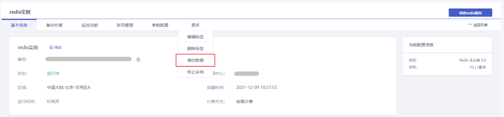
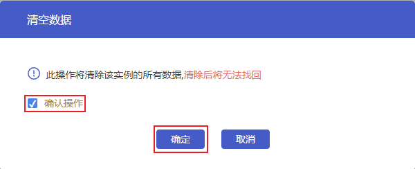

## 操作场景

根据实际业务需要，您可以在控制台或通过API接口清空Redis实例的全部数据。

> 注意：
>
> - 清空实例后数据将无法恢复，请您务必确认已完成数据备份后再进行清空实例操作。
> - 清空数据操作将影响实例对外提供的服务，且操作过程中实例无法访问，请您谨慎操作。

## 操作步骤

1. 登录数据库服务页面，在实例列表中选择需要清空数据的Redis实例，点击**实例名称**进入实例管理页面。
2. 点击**更多**展开更多操作项，点击**清空数据**。

3. 在弹框中，勾选**确认操作**后，点击**确定**，即可清空当前Redis实例的全部数据。

