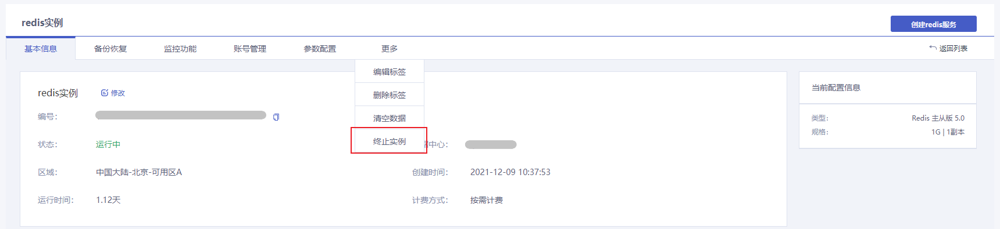
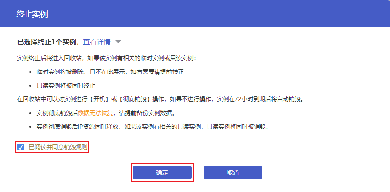

## 操作场景

根据实际业务需要，您可以在[控制台](https://console.capitalonline.net/dbinstances)手动终止Redis实例。

- 按需计费的实例手动终止后，实例被移入回收站保留3天。
- 包年包月的实例未开启自动续约的情况下，实例到期后自动终止，然后被移入回收站保留3天。

实例终止后，将不再产生与该实例相关的费用。

> 注意：
>
> - 实例终止后，将无法访问。如您想要恢复实例，可前往[回收站](https://console.capitalonline.net/dbinstances_recycle)进行开机恢复。
> - 在回收站中可以对实例进行**开机**或**彻底销毁**操作，如果不进行操作，实例被保留3天后将被自动彻底销毁。
> - 实例彻底销毁后数据无法恢复，请提前备份实例数据以防数据丢失。
> - 实例彻底销毁后IP资源同时释放。

## 操作步骤

1. 登录[云数据库Redis控制台](https://console.capitalonline.net/dbinstances)，在实例列表中选择需要终止的Redis实例，点击**实例名称**进入实例管理页面。
2. 点击**更多**展开更多操作项，点击**终止实例**。

3. 在弹框中，阅读销毁规则并勾选**已阅读并同意销毁规则**后，点击**确定**，即可终止当前的Redis实例。

