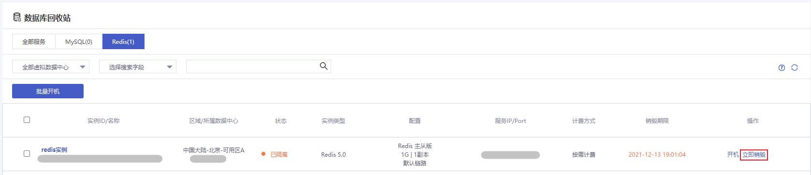
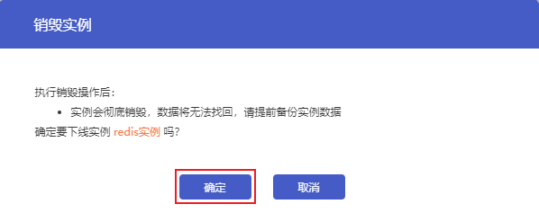

## 操作场景

Redis实例终止后进入[回收站](https://console.capitalonline.net/dbinstances_recycle)，您可以在回收站中手动销毁实例，或等待实例在回收站保留3天后自动销毁。

> 注意：
>
> - 实例处于已隔离状态时无法访问。
> - 实例彻底销毁后数据无法恢复，请提前备份实例数据以防数据丢失。
> - 实例彻底销毁后IP资源同时释放。

## 控制台销毁

### 操作步骤

1. 进入[云数据库回收站](https://console.capitalonline.net/dbinstances_recycle)。
2. 找到需要销毁的目标实例，点击**立即销毁**。

3. 确认销毁后，点击**确定**。

## API销毁

通过API销毁Redis实例，详情参见[销毁云数据库Redis实例](./../../07.API文档/02.实例相关接口/04.删除Redis实例.md)。

