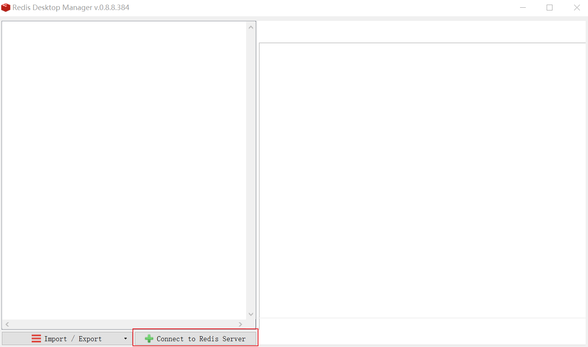
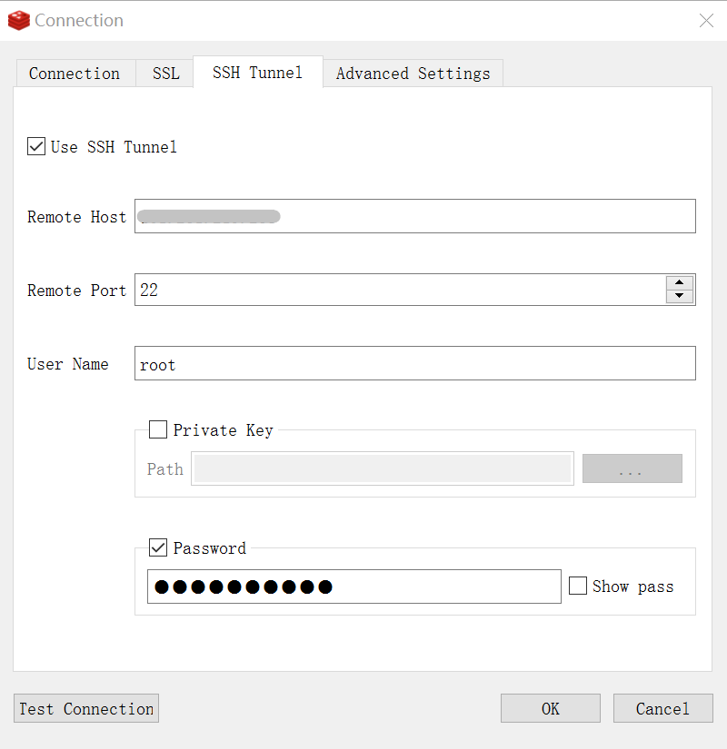
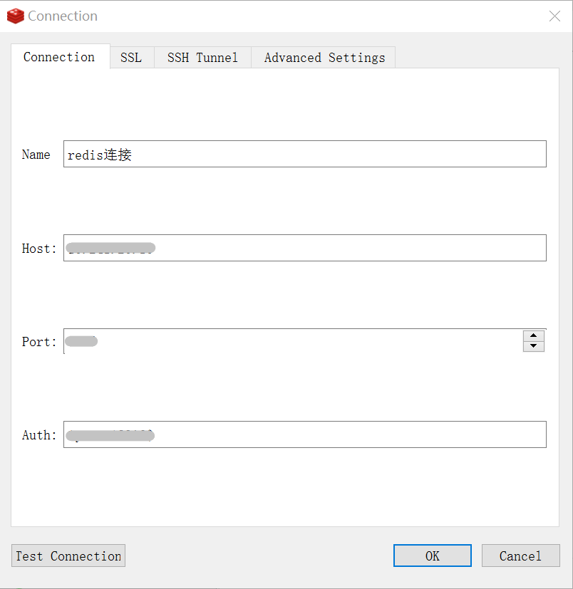
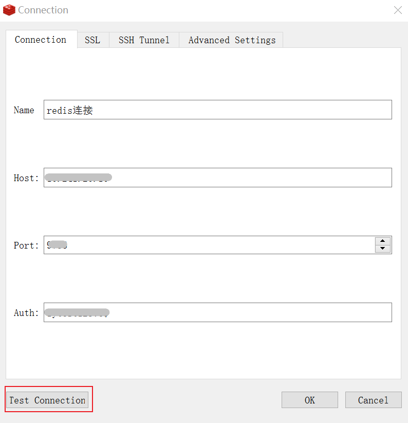
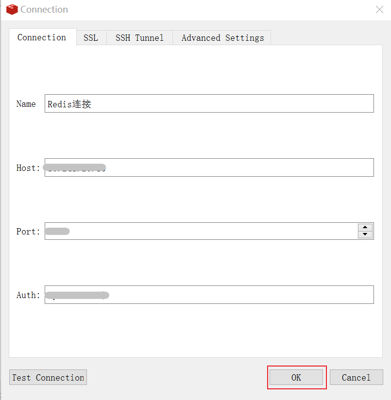
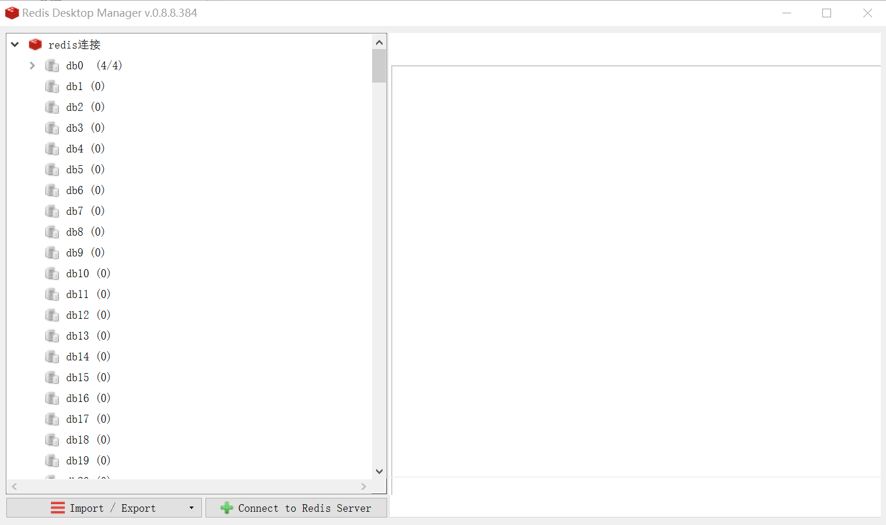

---
title:通过Redis Desktop Manager连接
date: 2021-12-31 14:29:00
permalink: /pages/477059/
article: true
---

Redis Desktop Manager是一款能够跨平台使用的开源性的Redis可视化工具。

## 前置条件

- 成功购买Redis实例，实例状态为运行中。购买Redis实例，详情参见[创建实例](./../../04.快速入门/00.创建Redis实例.md)。
- 您已创建好用于连接Redis的账号， 详情参见[创建与管理账号](./../../05.操作指南/07.账号与密码/00.创建与管理账号.md)，也可以直接使用default账号。
- 已在同一虚拟数据中心下成功购买云服务器，并将与云数据库Redis在同一私网网段的云服务器私网IP添加至Redis实例的白名单中，详情参见[设置白名单](./../../04.快速入门/01.设置白名单.md)。

## 通过Redis Desktop Manager连接

### 步骤1：安装Redis Desktop Manager

1. 下载安装包。
2. 双击进入安装过程，按照Windows一般安装软件的步骤操作即可。

### 步骤2：连接Redis

1. 双击打开Redis Desktop Manager，点击**Connect to  Redis Server**。

2. 点击**SSH Tunnel**，使用SSH Tunnel连接云服务器。

> 说明：
>
> - Remote Host：输入云服务器的公网IP
> - User Name：输入云服务器的用户名
> - 您可以任选Private Key 或Password认证方式进行认证连接

3. 切换到Connection页面，输入云数据库Redis的连接认证信息。

> 说明：
>
> - 开通免密认证访问的Redis实例无需输入密码。

4. 点击**Test Connection**，进行连接检测。

弹出以下提示，则表示可以成功连接。

5. 点击**OK**，即可连接Redis实例。

连接后可以在左侧菜单栏看到当前实例所有的数据库。

## 常见问题

[为什么Redis连接不上？](./../10.故障处理/00.Redis无法连接)

