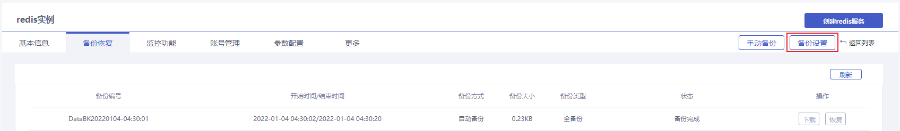
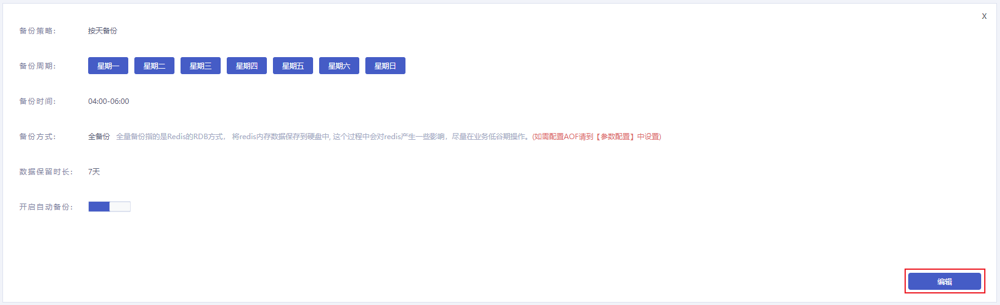
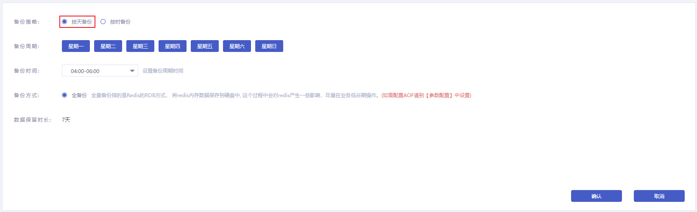
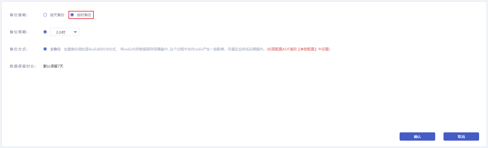
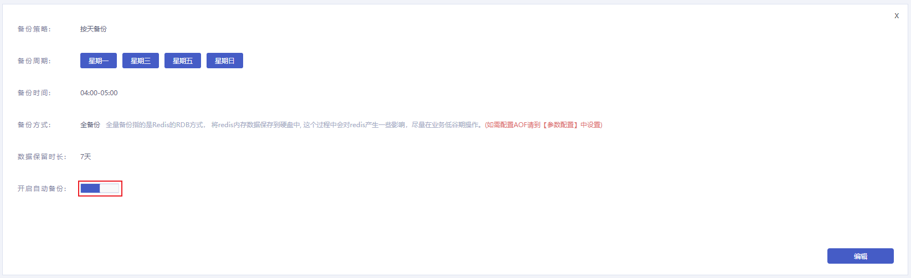
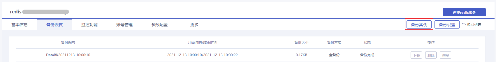
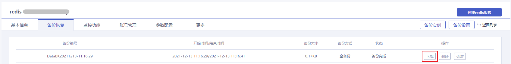
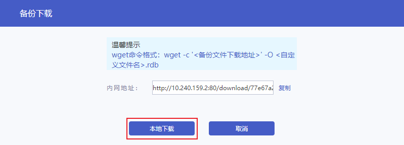
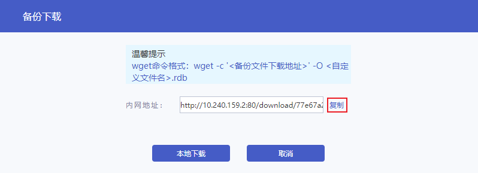
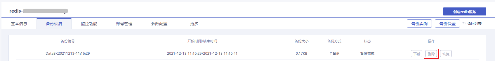

## 备份数据简介

云数据库Redis支持自动备份和手动备份。数据备份用于数据损坏或丢失，备份数据的格式为对应Redis版本的RDB快照文件。备份期间对您的实例访问不会产生性能影响。

- **自动备份**

云数据库Redis默认定期对实例的数据进行全量备份。备份周期可以进入[控制台](https://console.capitalonline.net/dbinstances)的备份恢复页面的**备份设置**中查看，默认设置的每天备份一次。如果您需要更高频率的备份，可以选择按时备份，备份周期最短可设置为每2小时备份一次。生成的备份文件存储于首云的对象存储中，免费保留7天，您可以在备份列表中看到当前保留的备份文件。自动备份功能支持在控制台根据您的需要自行关闭或开启。

- **手动备份**

您可以根据实际业务需求通过[控制台](https://console.capitalonline.net/dbinstances)进行手动备份。手动备份文件保留机制与自动备份文件无异，手动备份文件在免费保留期间支持在备份列表中手动删除。

## 控制台备份

### 自动备份

实例支持按天备份或按时备份，操作步骤如下：

1. 登录[云数据库Redis控制台](https://console.capitalonline.net/dbinstances)，点击**实例名称**进入到实例管理页面。
2. 点击**备份恢复**，进入实例备份恢复页面。
3. 点击**备份设置**，打开备份策略设置页面。



4. 点击**编辑**，开始设置自动备份策略。



5. 备份策略选择**按天备份**时，参数说明如下：

   - 备份周期：可以设置为一星期中的某一天或某几天，默认每天备份一次。
   - 备份时间：可设置为一天中的任意整点时段，以小时为单位，建议设置为业务低峰期时间。
   - 备份方式：全备份。指的是Redis的RDB方式，不可更改。
   - 数据保留时长：7天。指的时备份文件保留的天数，不可更改。

   

   备份策略选择**按时备份**时，参数说明如下：

   - 备份周期：可以设置为2小时、4小时、6小时、8小时、12小时。默认为2小时，指的是每2个小时备份一次。
   - 备份方式：全备份。指的是Redis的RDB方式，不可更改。
   - 数据保留时长：7天。指的时备份文件保留的天数，不可更改。

   

6. 点击**确认**，实例在自动备份时将按照设置的备份策略执行。


7. 点击自动备份的开启按钮，实例将按照设置好的备份策略进行自动备份。



>说明：
>
>- 支持根据实际业务情况自行开启或关闭自动备份。
>- 备份文件超出数据保留时长将被删除，无法继续使用。您可根据实际需要将备份文件[下载到本地](#下载备份)保存。
>- 如果受到相关进程影响，备份可能会延迟开始。

### 手动备份

实例支持手动备份，操作步骤如下：

1. 登录[云数据库Redis控制台](https://console.capitalonline.net/dbinstances)，点击**实例名称**进入到实例管理页面。
2. 点击**备份恢复**，进入实例备份恢复页面。
3. 点击**备份实例**，打开备份实例弹框。



4. 手动备份策略的参数说明如下：

   - 备份方式：全备份。指的是Redis的RDB方式，不可更改。
   - 数据保留时长：7天。指的时备份文件保留的天数，不可更改。

   点击**确定**，手动备份任务将在1分钟左右开始执行。


> 说明：
>
> - 备份文件超出数据保留时长将被删除，无法继续使用。您可根据实际需要将备份文件[下载到本地](#下载备份)保存。

### 下载备份

1. 登录[云数据库Redis控制台](https://console.capitalonline.net/dbinstances)，点击**实例名称**进入到实例管理页面。
2. 点击**备份恢复**，进入实例备份恢复页面。
3. 在备份列表中选择需要下载的备份文件，点击**下载**，打开备份下载弹框。



4. 在备份下载弹框中，选择下载方式。

   - 本地下载：

   点击**本地下载**，即可将备份文件下载到本地电脑中。

   

   - 内网下载：

     1）点击**复制**，复制内网下载地址。

   

     2）在云服务器上执行下述格式的命令（Linux系统）。

   ```
   wget -c '<备份文件下载地址>' -O <自定义文件名>.rdb
   ```

### 删除备份

1. 登录[云数据库Redis控制台](https://console.capitalonline.net/dbinstances)，点击**实例名称**进入到实例管理页面。
2. 点击**备份恢复**，进入实例备份恢复页面。
3. 在备份列表中选择需要删除的备份文件，点击**删除**，打开删除提示弹框。



4. 点击**确定**，删除当前备份文件。


> 说明：
>
> - 仅手动备份的备份文件在数据保留时长内支持手动删除，超出数据保留时长后将被自动删除。
> - 自动备份的备份文件不可手动删除，超出数据保留时长后将被自动删除。

## API备份

通过API手动备份，详情参见[手动创建云数据库Redis备份](./../../07.API文档/03.备份相关接口/02.创建备份.md)。

通过API下载备份文件，详情参见[下载云数据库Redis实例备份文件](./../../07.API文档/03.备份相关接口/01.获取备份文件信息及备份文件下载地址.md)。

通过API删除备份文件，详情参见[删除云数据库Redis实例备份文件](./../../07.API文档/03.备份相关接口/03.删除备份文件.md)。

