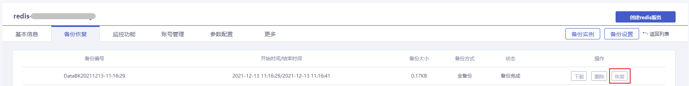
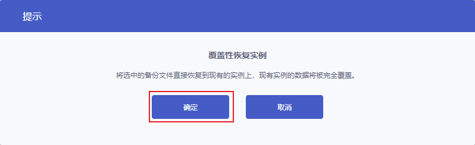

## 恢复数据简介

云数据库Redis支持基于备份文件恢复至现有实例，实现数据回档。实例恢复将清空原有实例的数据，将指定的备份数据恢复到实例中，恢复过程中实例无法访问，不能对外提供服务。您可以在[控制台](https://console.capitalonline.net/dbinstances)的备份恢复页面的备份列表中选择相应的备份文件进行恢复。

## 前置条件

Redis实例已备份完成，备份操作详情参见[备份数据](./00.备份数据.md)。

## 操作步骤

1. 登录[云数据库Redis控制台](https://console.capitalonline.net/dbinstances)，点击**实例名称**进入到实例管理页面。
2. 点击**备份恢复**，进入实例备份恢复页面。
3. 在备份列表中选择需要恢复的备份文件，点击**恢复**，打开恢复实例提示框。

4. 点击**确定**，实例状态进入备份恢复中。待实例状态恢复至运行中，即可正常使用。

> 说明：
>
> - 备份恢复后，现有实例的数据将被覆盖，且无法恢复。
>
> - 如果Redis实例进行过降配操作，您需要保证当前实例规格大于恢复后数据容量，否则会导致数据恢复失败。
