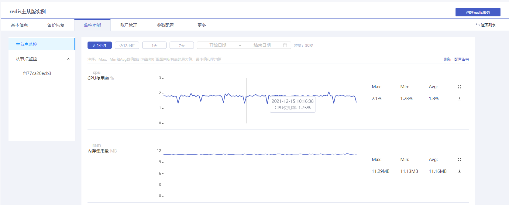
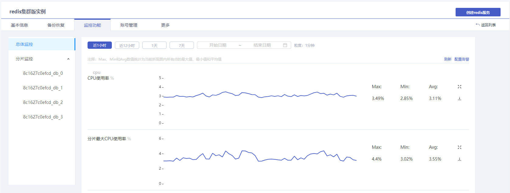

## 操作场景

云数据库Redis提供可视化运行监控功能，帮助您及时掌握实例的运行情况，进行问题溯源。Redis社区主从版提供节点监控，包括主节点和副本节点。Redis社区集群版提供总体监控和各个分片监控。

> 注意：
>
> - 目前云数据Redis最长支持查看近**90天**的监控数据。

## 监控粒度

| 时间跨度  | 监控粒度 | 自适应说明                                    | 保留时长 |
| --------- | -------- | --------------------------------------------- | -------- |
| (0h,4h]   | 30s      | 时间跨度在4小时内，监控粒度为30秒             | 90天     |
| (4h,2d]   | 1min     | 时间跨度超过4小时，但在2天内，监控粒度为1分钟 | 90天     |
| (2d,10d]  | 5min     | 时间跨度超过2天，但在10天内，监控粒度为5分钟  | 90天     |
| (10d,30d] | 1h       | 时间跨度超过10天，但在30天内，监控粒度为1小时 | 90天     |

> 说明：
>
> - 监控粒度实行自适应策略，不支持自定义选择

## 操作步骤

1. 登录[云数据库Redis控制台](https://console.capitalonline.net/dbinstances)，点击**实例名称**进入到实例管理页面。
2. 点击**监控功能**，进入实例监控页面。
3. 在左侧可切换节点（社区主从版）或切换分片（社区集群版）查看监控情况。
4. 选择监控数据显示时段查看监控情况。可选监控数据显示时段：近1小时（默认），近12小时，1天，7天，自定义时间（最长可选30天）。监控指标详情参见[监控指标说明](./01.监控指标说明.md)。

- 社区主从版

- 社区集群版

