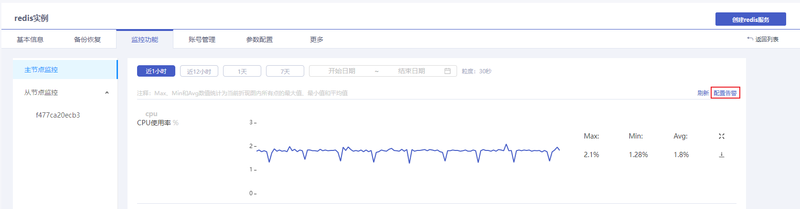
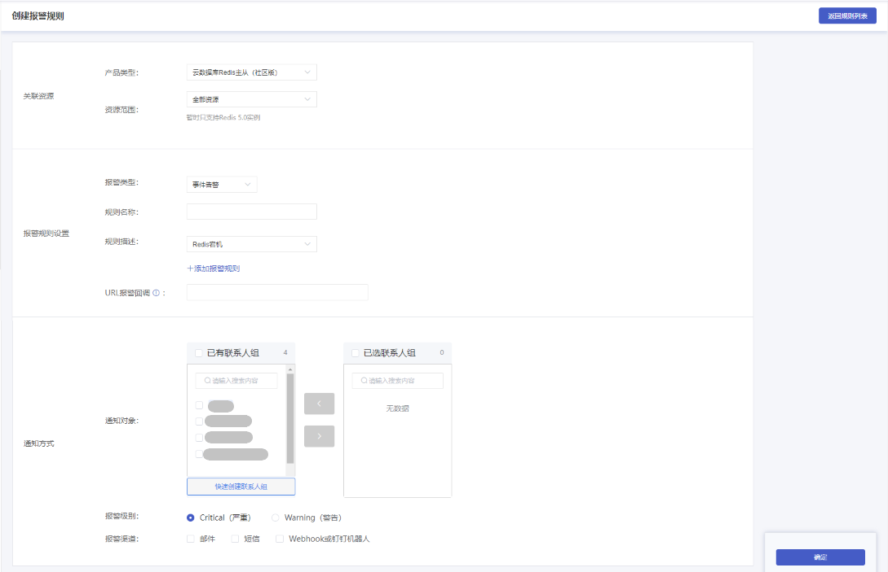

## 操作场景

云数据库Redis提供全方位的自定义告警功能。您可以创建报警策略，用于在云数据库Redis的指标数据超过设置阈值或示例发生异常时触发告警并发送通知。当云数据库Redis触发告警时，您可以及时做出相应预判并采取补救措施。因此，合理地设置告警策略能够帮助您提高云数据库服务的的健壮性和可靠性。

## 前置条件

您已成功购买Redis实例，实例状态为运行中。购买Redis实例，详情参见[创建实例](./../../04.快速入门/00.创建Redis实例.md)。

## 操作步骤

1. 登录[云数据库Redis控制台](https://console.capitalonline.net/dbinstances)，点击**实例名称**进入到实例管理页面。
2. 点击**监控功能**，进入实例监控页面。
3. 点击**配置告警**，进入报警服务页面。

4. 点击左侧二级导航栏**报警规则**进入报警规则页面，点击**创建报警规则**。

5. 在创建报警规则页面设置告警规则，具体内容如下：
   - 产品类型：目前云数据库Redis的报警规则产品类型分为Redis集群（社区版）、Redis主从（社区版）、Redis经济型主从，需根据您的Redis实例类型选择。
   - 资源范围：可选择当前产品类型下的全部资源或指定实例。
   - 报警类型：可选择设置指标告警和事件告警。
   - 规则名称：您可以自行定义。
   - 规则描述：为已选择的Redis实例设置报警规则。告警规则详情参见[告警规则说明](./03.告警规则说明.md)。
   - URL报警回调：您可以根据需要填入回调URL来调用报警信息。
   - 通知对象：选择联系人组，报警规则触发时将通知到联系人组中的所有联系人。
   - 报警级别：根据需要为当前报警规则定义报警级别。
   - 报警渠道：可以选择一个或多个报警渠道来接收报警信息，目前支持邮件、短信、Webhook三种渠道。
   
   告警规则设置完成后，点击**确定**。
   
   

> 说明：
>
> Redis主从（社区版）产品类型下暂时只支持选择5.0版本的Redis主从实例。
>
> Redis经济型主从产品类型下支持选择2.8版本、4.0版本的Redis主从实例。

