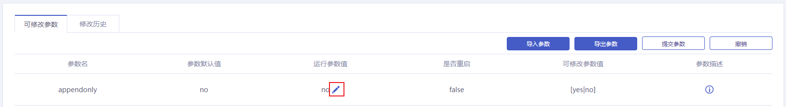
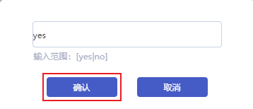
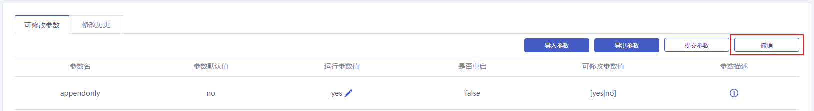
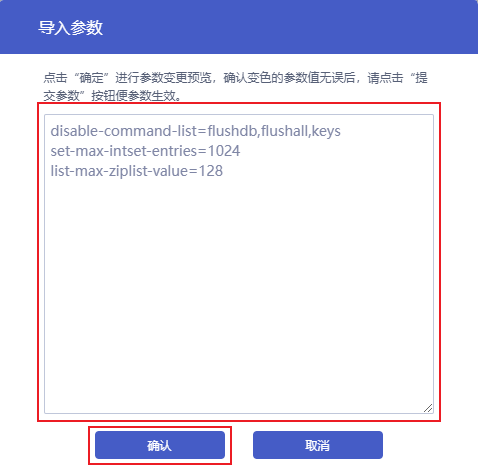
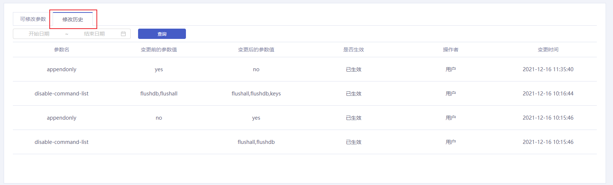

## 操作场景

云数据库Redis支持自定义实例部分参数的值。您可以在[控制台](https://console.capitalonline.net/dbinstances)查看和修改支持的参数，并可以在控制台查看参数修改记录。

> 注意：
>
> - 目前仅社区主从版支持参数配置。
> - 参数配置页面展示的参数即为您可以自行修改参数值的参数。
> - 部分参数修改后需要重启实例。修改此类参数时，建议您在业务低峰期操作，并确保应用程序具有重连机制。

## 操作步骤

### 修改单个参数

1. 登录[云数据库Redis控制台](https://console.capitalonline.net/dbinstances)，点击**实例名称**进入到实例管理页面。
2. 点击**参数配置**，进入参数配置页面。
3. 在可修改参数列表中找到需要修改的参数，点击运行参数值后面的。

4. 在弹框中输入参数值，输入范围参考可修改参数值列或输入框下方的提示，确认无误后点击**确认**。

5. 点击**提交参数**，即可完成参数修改。

   

   如果您要取消本次修改，请在修改的参数未提交时，点击**撤销**，即可取消本次修改。

   

### 批量修改参数

1. 登录[云数据库Redis控制台](https://console.capitalonline.net/dbinstances)，点击**实例名称**进入到实例管理页面。
2. 点击**参数配置**，进入参数配置页面。
3. 点击**导出参数**，平台会将所有可修改的参数以txt格式的文件保存到本地。

4. 在本地打开导出的参数文件，修改参数值。
5. 修改完成后，重新进入参数配置页面。点击**导入参数**。

6. 将待修改的参数粘贴到导入参数弹框的输入框中。确认无误后，点击**确认**。

7. 点击**提交参数**，即可完成参数修改。

   

> 说明：
>
> - 修改的参数值背景会变为深色，便于您确认正在修改的参数。
> - 当有不符合参数范围的值出现时，会红色高亮提示，需要您参考可修改参数值进行修改。

### 查看修改历史

1. 登录[云数据库Redis控制台](https://console.capitalonline.net/dbinstances)，点击**实例名称**进入到实例管理页面。
2. 点击**参数配置**，进入参数配置页面。
3. 点击**修改历史**，可按照时间范围查看参数修改的历史记录。

