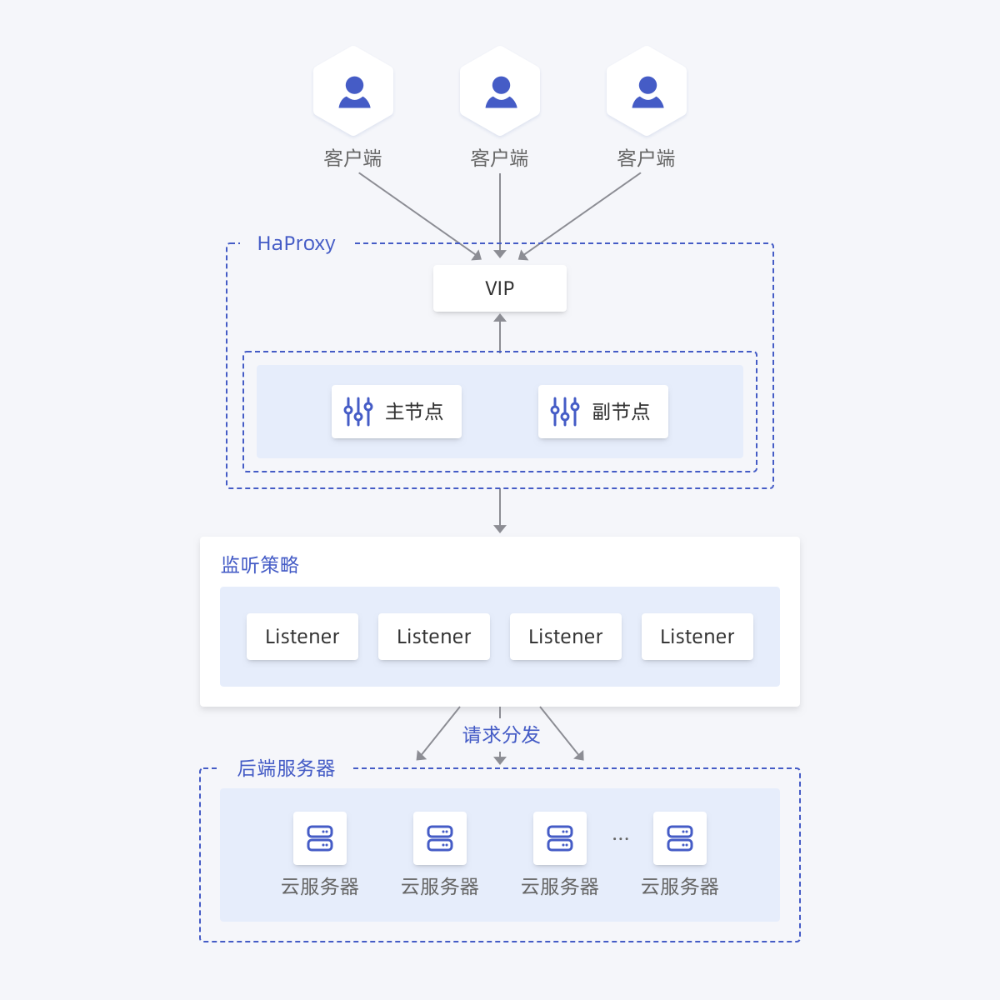

负载均衡 HaProxy 提供四层（TCP 协议）和七层（HTTP 协议/HTTPS 协议）负载均衡。您可以通过负载均衡 HaProxy 将客户端发送的请求根据监听策略分发到后端服务器上，提高业务可用性。

## 基础架构

负载均衡 HaProxy 当前提供四层与七层的负载均衡服务：

首云基于Haproxy自研,支持高可用、高并发的四层和七层负载均衡服务。架构上区别其他云厂商集群架构，而是实例型，即每个节点单独占用一台云服务器，共包含两个节点分别是主节点和备份节点，并依赖内部调度算法保障两个节点不会归属到同一个物理资源。四层负载和七层负载也区别其他云厂商，不是先四层集群网关再到七层集群网关，而是使用同一个 HaProxy 进程完成的四层和七层的转发。

## 转发路径

负载均衡负责转发业务流量，由后端服务实际处理业务请求。四层的转发路径和七层的转发路径是相同的，即客户端->HaProxy->后端云服务器。

**具体说明**

首先客户端会发送一个请求到负载均衡上面。客户端和负载均衡会创建独立的一条连接，连接建立起来以后将请求发送到负载均衡上面，接收到客户端的请求之后（四层和七层对报文的行文是不同的，四层不会读取报文内容，七层会对报文做一定的处理），由负载均衡在和后端云服务器再建立起另外一条独立的连接（在建立连接之前，先由调度算法选择已注册的后端云服务器），然后将请求发送到后端云服务器上。这就完成客户端和后端云服务器通信的完整过程。

**总结**

整个处理过程是建立了两条独立的 TCP 连接，客户端和负载均衡器建立了一条 TCP 连接，然后负载均衡器和后端云服务器又建立了一条 TCP 连接。
