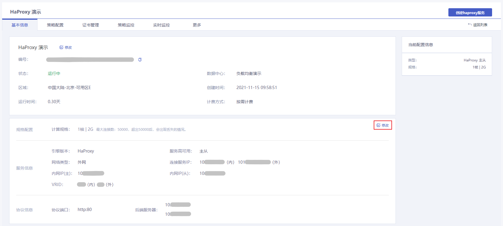
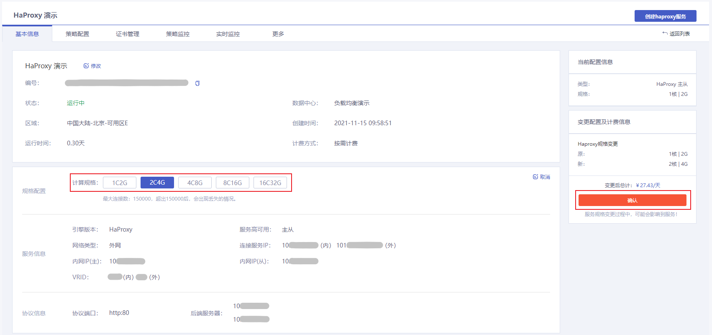

## 控制台修改

### 操作场景

根据您的业务情况，您可以在控制台灵活修改您的 HaProxy 实例配置，从而降低成本以及使资源得到充分利用。调整资源费用变更详情参见 [调整实例费用说明](../../02.购买指南/03.调整实例规格费用说明.md)。

### 配置规则

- HaProxy 实例状态为运行中
- 配置变更中状态禁止再进行调整配置操作
- 配置变更中状态禁止进行策略配置修改操作
- 配置变更时，会有8s左右闪断，建议在业务低峰期操作

### 操作步骤

1. 进入 [负载均衡控制台](https://console.capitalonline.net/loadbalancers)，在实例列表中选择需要调整资源的实例，点击实例名称进入实例管理页面。

   

2. 在基本信息页中找到规格配置模块，点击右侧**修改**。

   

3. 在当前页面选择您要调整的配置，确认后点击**确认**即可。

   

## API 修改

通过 API 修改负载均衡 HaProxy 实例规格，详情参见 [创建负载均衡HaProxy实例](../../09.API文档/02.实例相关接口/05.修改负载均衡HaProxy实例规格.md)。

## 常见问题

### 1.调整负载均衡实例规格，对实例有什么影响吗？

配置变更时，会有8s左右闪断，建议在业务低峰期操作。

### 2.为什么我无法查看实时监控？

只有运行中的服务才能查看实时监控，同时配置变更中状态禁止再进行策略配置修改操作。
