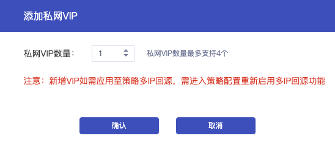

## 操作步骤

1. 进入 [负载均衡控制台](https://console.capitalonline.net/loadbalancers)，选择需要配置私网VIP数量的实例，点击实例 ID 。

2. 在基本信息页中下方服务信息模块，点击 **添加私网VIP**。

   

3. 在添加私网 VIP 窗口中，选择私网 VIP 数量，一个实例最多支持 4 个私网 VIP。确认无误后，点击 **确认** 即可。

   
   
   > 注意：
   >
   > 新增 VIP 如需应用至后端机器多IP回源，需进入策略配置 **重新启用** 多IP回源功能。
