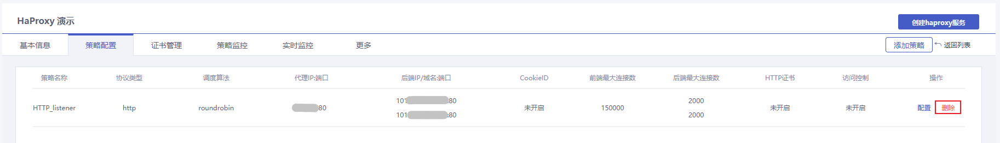

## 前置条件

您已创建负载均衡监听策略，且负载均衡实例状态为运行中。

## 控制台删除

### 操作步骤

1. 进入 [负载均衡控制台](https://console.capitalonline.net/loadbalancers)，在实例列表中选择需要删除策略的实例，在“操作”列选择 **策略配置** 或进入到实例管理页面选择 **策略配置** 。

2. 在策略配置页面，选择需要修改的监听策略，点击操作中的 **删除**。

   

3. 在删除确认弹窗中，点击 **确定** 即可删除策略。

   

## API删除

通过 API 删除负载均衡监听策略，详情参见 [删除负载均衡实例监听策略](../../09.API文档/03.监听策略相关接口/01.修改监听策略.md)。
