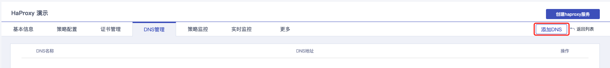
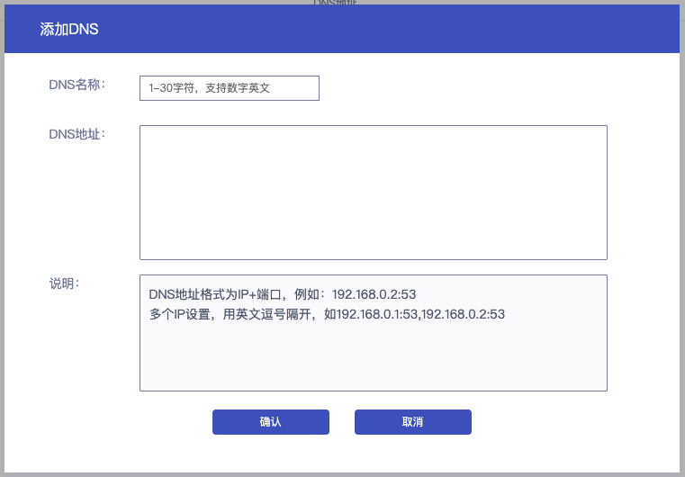
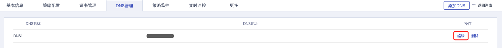
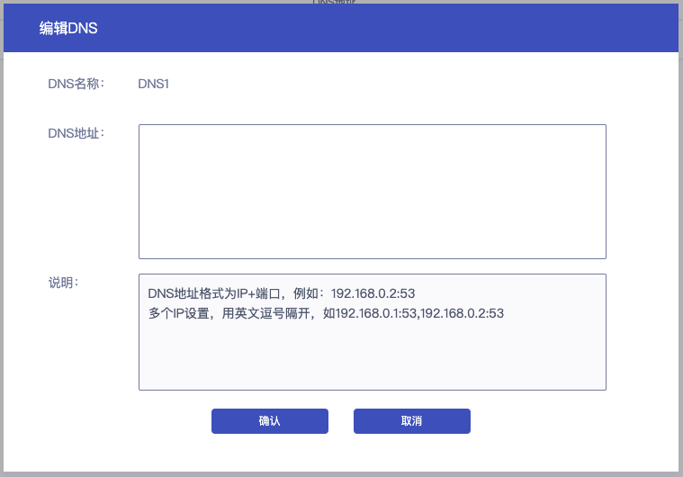
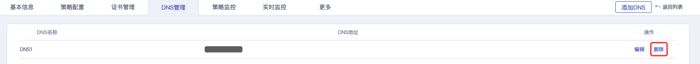
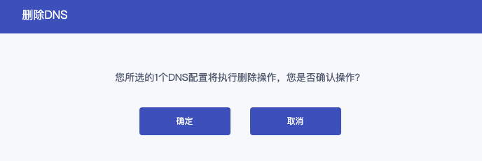

## 控制台添加

### 操作步骤

1. 进入 [负载均衡控制台](https://console.capitalonline.net/loadbalancers)，在实例列表中选择任意实例，在实例管理页面选择 **DNS管理** 。

2. 在DNS管理页面，点击右上方 **添加DNS**。

   

3. 在添加DNS弹窗中，配置DNS名称与地址后，点击 **确定** 即可添加DNS记录。

   

## 控制台编辑

### 操作步骤

1. 进入 [负载均衡控制台](https://console.capitalonline.net/loadbalancers)，在实例列表中选择任意实例，在实例管理页面选择 **DNS管理** 。

2. 在DNS管理页面，选择需要编辑的DNS记录，点击操作中的 **编辑**。

   

3. 在编辑DNS弹窗中，配置DNS地址后，点击 **确定** 即可编辑DNS记录。

   

## 控制台删除

### 操作步骤

1. 进入 [负载均衡控制台](https://console.capitalonline.net/loadbalancers)，在实例列表中选择任意实例，在实例管理页面选择 **DNS管理** 。

2. 在DNS管理页面，选择需要删除的DNS记录，点击操作中的 **删除**。

   

3. 在删除DNS弹窗中，点击 **确定** 即可删除DNS记录。注意：已被监听策略选用的DNS不支持删除。

   
