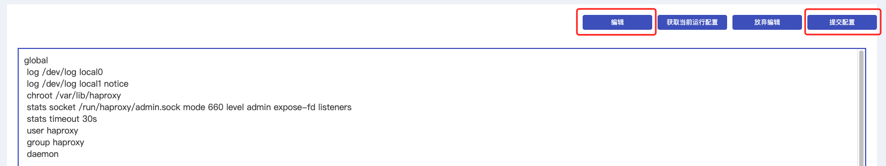

高级配置为负载均衡 HaProxy 提供的直接修改配置文件的功能，您可以通过直接修改 HaProxy 配置文件的方式来配置您的监听策略。

## 控制台配置

### 操作步骤

1. 进入 [负载均衡控制台](https://console.capitalonline.net/loadbalancers)，在实例列表中选择需要添加策略的实例，在“操作”列选择 **策略配置** 或进入到实例管理页面选择 **策略配置** 。

2. 在策略配置页面，点击右上角 **切换至高级配置**。

   

3. 在高级配置说明弹窗中，点击 **确认**。

   

4. 在高级配置页面，您可查看配置文件，并编辑修改，点击 **编辑** 即可编辑配置文件，配置完成检查无误后，点击 **提交配置**。配置文件配置方式，详情参见 [官方文档](http://cbonte.github.io/haproxy-dconv/2.4/configuration.html#2)。

   

5. 在提交并启用高级配置弹窗中，点击 **确认** 即可启用高级配置。

   

>**注意**:
>
>+ 仅当首次启用高级配置时会同步当前运行中配置
>+ 高级配置启用后将直接修改当前 Haproxy 配置文件，且不支持原基础配置 OpenAPI 与功能
>+ 基础配置与高级配置相互切换并不会立即启用，均需对策略配置完成变更后自动启用
>+ 获取当前配置按钮将根据当前配置方式获取运行中的配置文件覆盖高级配置文件并进入编辑状态

## API配置

通过 API 修改自定义配置文件，详情参见 [修改自定义配置文件](../../09.API文档/03.监听策略相关接口/04.修改自定义配置文件.md)。
