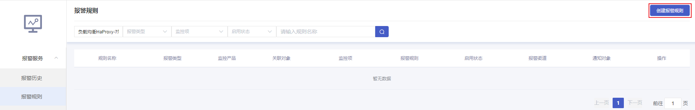
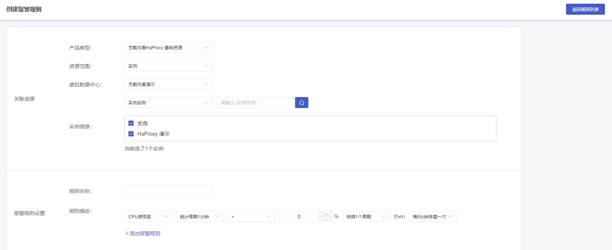

#### 前置条件

您已成功创建负载均衡 HaProxy 实例，实例状态为运行中，创建实例步骤详情参见 [创建负载均衡实例](F:\首云工作相关\PaaS产品线\弹性计算产品\负载均衡\用户操作手册\HaProxy\04.操作指南\00.负载均衡实例\00.创建负载均衡实例.md)。

#### 创建报警策略

##### 操作步骤

1. 进入 [负载均衡控制台](https://console.capitalonline.net/loadbalancers)，在实例列表中选择负载均衡实例，在“操作”列选择 **策略监控** 或进入到实例管理页面选择 **策略监控** 。

2. 在策略监控页面，点击右上角 **配置告警**。

   

3. 在报警服务页面，选择右侧导航中 **报警规则**，点击右上角 **创建报警规则**。

   
   
4. 在创建报警规则页面选择负载均衡 HaProxy 的报警类型，当前 HaProxy 的报警规则产品类型分为基础资源、4层监听与7层监听，根据您的需求创建报警规则 。

   

5. 选择您的资源范围，负载均衡 HaProxy 报警规则支持全部资源与指定实例，选择完成后即可配置报警规则。

   

6. 更多负载均衡监控指标介绍，详情参见 [报警指标说明](F:\首云工作相关\PaaS产品线\弹性计算产品\负载均衡\用户操作手册\HaProxy\04.操作指南\03.监控报警\03.报警指标说明.md)。
