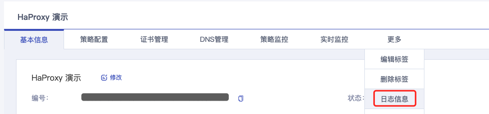
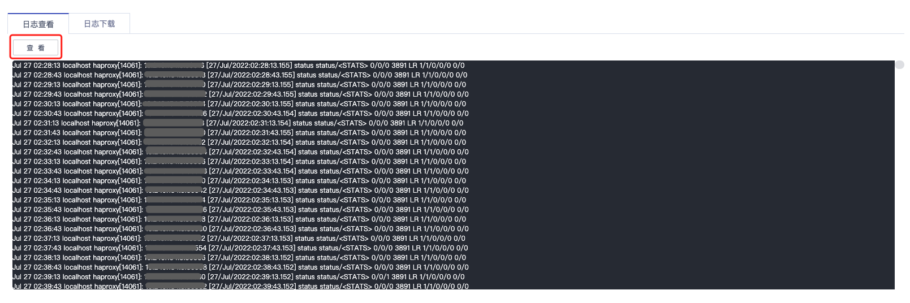
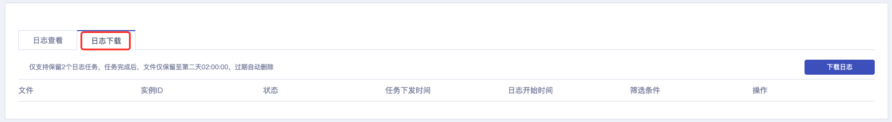
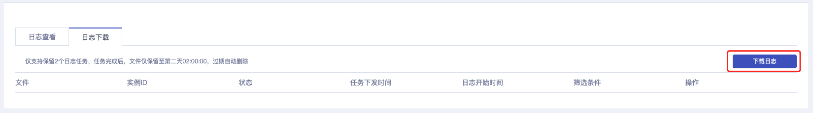
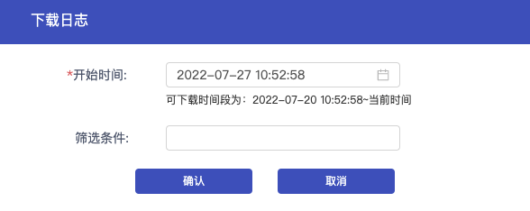
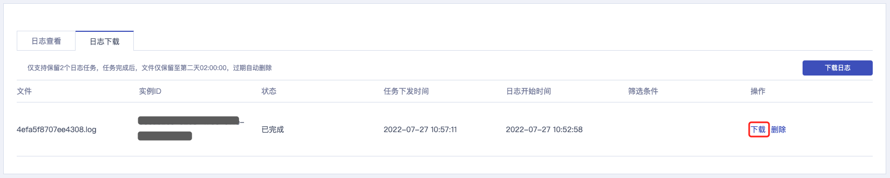

负载均衡 HaProxy 提供日志查看与下载功能，您可以通过日志了解实例状态与排查问题。

## 日志查看

1. 进入 [负载均衡控制台](https://console.capitalonline.net/loadbalancers)，在实例列表中选择需要查看日志的实例，在“操作”列选择 **日志信息** 或进入到实例管理页面更多中选择 **日志信息**。

   

2. 在日志信息页面，查看当前实例日志，默认展示最近 1000 条日志信息。

3. 点击 **查看**，更新最近 1000 条日志信息。

   

## 日志下载

1. 进入 [负载均衡控制台](https://console.capitalonline.net/loadbalancers)，在实例列表中选择需要查看日志的实例，在“操作”列选择 **日志信息** 或进入到实例管理页面更多中选择 **日志信息**。

   

2. 在日志信息页面，点击 **日志下载**。

   

3. 点击日志任务列表上方 **下载日志**。

   

4. 在弹出的下载日志窗口中，选择日志开始时间，支持筛选过滤日志，完成后单击 **确认**。

   

5. 在日志任务列表中查看任务进度，待任务状态变为 **已完成** 后，点击操作中 **下载** 即可下载日志文件。

   

   >**注意**:
   >
   >+ 日志任务列表为全部 HaProxy 实例日志任务
   >+ 每个账号仅支持保留 2 个日志任务，任务完成后，文件仅保留至第二天 02:00:00，过期自动删除
   >+ 支持手动删除日志任务
