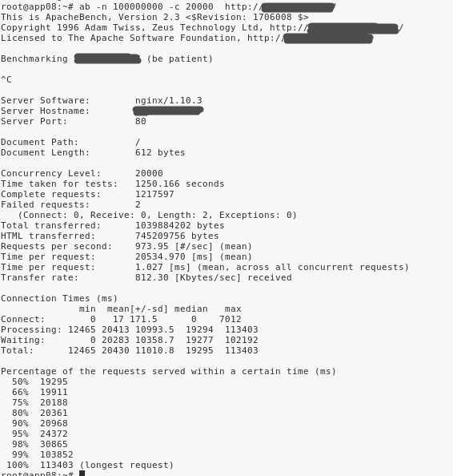

当前测试为 HTTP，如果是 HTTPS，支持的最大连接数会有所减少。

## 测试方法

使用ab工具进行压力测试，后端云服务器部署nginx1.10.3服务监听端口80，返回的数据hello world ${n}

- 后端服务类型： web服务(nginx默认服务，端口80)
- 网络模型：同一个内网
- 前端调用类型：GET 方法

### 验证连通性

 测试前先判断连通性，方法：

curl http://{负载均衡服务IP}:${策略监听端口}/ 

例子参考： 

```shell
~$ curl http://192.168.5.11:80/
~$ hello world 1
```

### 测试工具下载

centos系统：

```shell
~$ yum -y install httpd-tools
```

ubuntu系统：

```shell
~$ sudo apt-get install apache2-utils
```

### 测试命令

- -n  表示总请求数
- -c 表示并发数量

```shell
~$ ab -n 100000000 -c 20000 http://192.168.5.11:80/
```


## 测试数据

| 规格  | 配置最大连接数 | 模式 | 客户端数量 | 服务器端数量 | 总并发数 | 前端QPS | session-rate-max | session-rate-avg | 最大支持session-max | 平均支持session-max | 描述                                                         |
| ----- | -------------- | ---- | ---------- | ------------ | -------- | ------- | ---------------- | ---------------- | ------------------- | ------------------- | ------------------------------------------------------------ |
| 1c2G  | 50000          | http | 2          | 10           | 2*100k   | 9800    | 18377            | 8500             | 50000               | 21000               | CPU基本没有空闲，建议限速session rate 5000，连接最大：5000   |
| 2c4G  | 200000         | http | 7          | 10           | 7*100k   | 920     | 19963            | 8000             | 200000              | 180000              | 最多支持7个客户端压测，再多系统就会出现wa迅速增加，而且sys也会增长 |
| 4c8G  | 500000         | http | 15         | 10           | 15*100k  | 1054    | 28608            | 21000            | 360000              | 360000              | 建议限速session rate 400000，连接最大 400000，后端最大连接为 20000（继续压测的话，内存和HaProxy写入磁盘将会是瓶颈） |
| 8c16G | 800000         | http | 26         | 25           | 26*100k  | 641.12  | 25024            | 20000            | 700000              | 700000              | 建议限速session rate 700000，连接最大 700000，后端最大连接为 30000（继续压测的话，客户端程序报错，连接超时错误） |

## 测试结果

### 2C4G测试结果截图



### 4C8G测试结果截图


### 8C16G测试结果截图


